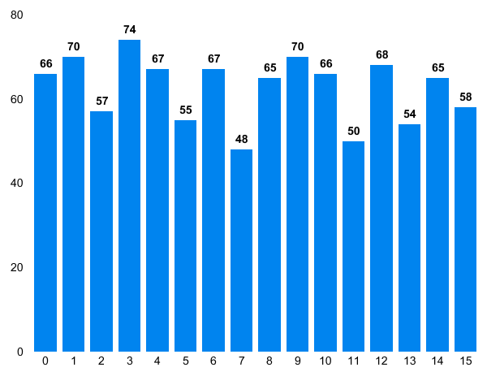

<p align="center">
  
  <br/><br/>
</p>
<p align="center">
   Create random id's and numbers in base 16!
</p>
[](https://travis-ci.org/jessevdp/id-16)
[](http://standardjs.com/)

# Intro
Use the simple function to quickly generate a random base 16 ([hexadecimal](https://en.wikipedia.org/wiki/Hexadecimal)) number or create a generator and then use it to create loads of random numbers of the same length which are checked for collisions. This is useful for creating unique ID's and whatnot.

# Basic usage
Create a random hex number:
```js
var id_16 = require('id-16')
var random = id_16(10)
// e.g. 63f499b6f4
```

Create a generator and use it:
```js
var id_16 = require('id-16')
var id = id_16.generator(4)
user_1 = id() // -> 63f4
user_2 = id() // -> b6ab
```

# Documentation
All the current functions are doccumentet. If you have any comments or suggestions please go [here](#suggestions).

## id_16([length])
This function creates a random number in base 16.
**Returns**: A number in base 16.

| param | type | description |
| --- | --- | ---|
| lenght | `Number` optional | The desired length of the return number.  *(Default: 8)* |

## id_16.generator([length, expandby])
This function returns a function that creates random base 16 numbers. This generator checks the numbers for collisions. If too many collisions occur an error is thrown or (if expandby is defined) the length of the number is expanded.
**returns**: The generator

| param | type | description |
| --- | --- | ---|
| lenght | `Number` optional | The desired length of the return number.  *(Default: 8)* |
| expandby | `Number` optional | Expand the length of the return number by this number if too many collisions occur.|


This generator also has some properties and methods:
### generator.remove(number)
Removes a number from the list of numbers that have been created by this generator, allowing the number to be created again.

| param | type | description |
| --- | --- | ---|
| number | `Number` | The number that you want to delete from the list of already 'used' numbers by **this** generator. |

### generator.list
An array containing all the numbers that have been created by **this** generator. It's used to check for collisions by the generator itself but it is open to interact with.

# creation of random numbers
The program currently uses the following function to generate the numbers: 
```js
var random_number = Math.floor(Math.random() * 16)
```
This creates a number between 0 and 15 after which the number is then converted into base 16. This process is then repeated for the desired length of the number and the numbers are added onto a string. This string is what's returned by the function. 

### Is it truly random? 
Many people state that `Math.random()` is not truly random. I'm not going to debate weather or not this is true however I am goign to show you the results I got.

I runned the function in a loop creating 1000 random numbers between 0 and 15, the following graph shows just how many times each number was returned by the function: 

<p align="center">
  
  <br/><br/>
</p>

As you can see the numbers are all created about as many times. I think it's good enough for this purpose but I'm open to any suggestions! So please let me know if you think you've got a better way of creating truly random numbers.


# Suggestions
If you have any suggestions or want something to be implemented please [submit an issue](/issues) or [open a pull request](/pulls)! 

# License & Disclaimer
This module is open-sourced under the MIT Licence (see [LICENSE](LICENSE) for the full license). So within some limits, you can do with the code whatever you want.

The software is provided as is. It might work as expected - or not. Just don't blame me.
